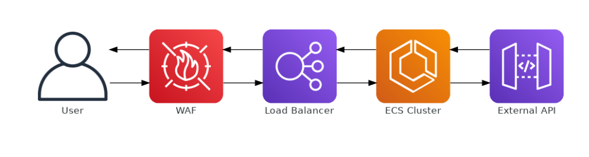

# Text Generation City Weather

This project is an API that provides weather information and generates funny texts about the weather in different cities. The API also translates the generated texts to Portuguese.

## Installation

1. Clone the repository:
    ```bash
    git clone git@github.com:jackpa84/weather_app.git
    cd text-generation-city-weather
    ```

2. Obtain an API key from [OpenWeatherMap](https://home.openweathermap.org/users/sign_up):
    - Sign up or log in to your OpenWeatherMap account.
    - Navigate to the "API keys" section in your account settings to create or find your API key.

3. Create a `.env` file in the project root and add your API key:
    ```dotenv
    API_KEY=your_api_key_here
    ```

## Usage

1. Activate the virtual environment:
    ```bash
    poetry shell
    ```

2. Run the application:
    ```bash
    uvicorn app.main:app --host 0.0.0.0 --port 8000
    ```

3. Access the API at `http://localhost:8000/weather?city=<CITY_NAME>`.

## Running with Docker

1. Build and start the containers:
    ```bash
    docker-compose up --build
    ```

2. Access the API at `http://localhost:8000/weather?city=<CITY_NAME>`.

## Project Structure

- `app/main.py`: Entry point of the application.
- `app/services.py`: Contains the service logic.
- `app/routers/weather.py`: Router for the weather service.
- `tests/test_weather.py`: Contains the application tests.
- `Dockerfile`: Docker configuration file.
- `docker-compose.yml`: Docker Compose configuration file.
- `pyproject.toml`: Poetry configuration file.
- `.env`: Environment variables file.

## Application Flow

For a detailed overview of the application's architecture, refer to the [Architecture Documentation](docs/architecture_application.md).

