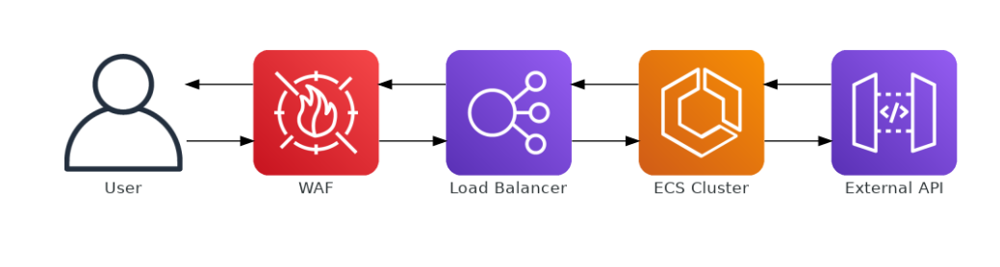

# Application Architecture "Text Generation City Weather"

The architecture of the application is designed to be modular and scalable, utilizing common practices in RESTful API development and microservices. Below, we detail the main components and the general architecture of the application:

## Main Components

1. **Weather API**
2. **Translation Services**
3. **Routing Layer**
4. **Dependency and Configuration Management**
5. **Containerization**

### 1. Weather API

The Weather API is the core of the application. It makes calls to an external API (OpenWeatherMap) to obtain weather data for a city specified by the user. The service then processes this data to generate a humorous weather description, which is returned to the user.

**Data Flow:**
- The user makes a request to the API with the city name.
- The API consults the external service (OpenWeatherMap) using an API key stored in environment variables.
- The received data is processed and transformed into a descriptive text.
- The final response is returned to the user.

### 2. Translation Services

This component is responsible for translating the generated text into Portuguese, if necessary. It is integrated into the data flow of the Weather API, being triggered after the weather descriptive text is generated.

**Technologies Used:**
- External translation APIs, if necessary (not specified in the README).

### 3. Routing Layer

The routing layer manages HTTP requests and directs them to the appropriate services within the application. In the project, this functionality is primarily managed through the FastAPI framework.

**Architecture:**
- The file `app/routers/weather.py` defines the specific routes for the weather service.

### 4. Dependency and Configuration Management

- **Poetry**: Used to manage dependencies and virtual environments, ensuring a consistent development environment.
- **Environment Variables**: Sensitive settings, such as API keys, are managed through `.env` files, protecting sensitive information.

### 5. Containerization

To ensure consistent and simplified deployment, the application is containerized using Docker. This includes both the Dockerfile to build the application image and docker-compose to orchestrate multiple containers if necessary.

- **Dockerfile**: Defines the image construction, including dependency installation and environment configuration.
- **docker-compose.yml**: Facilitates the orchestration of containers, useful for development and production environments.

## Application Flow Diagram

The flow diagram (`flow.png`) provides a visual overview of the path a request takes from the client to the response, passing through the various components of the application.
